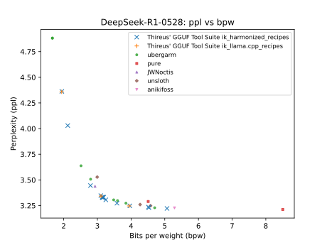

<h2 align="center">💖 Support GGUF-Tool-Suite</h2>

<p align="center">
  <a href="https://www.patreon.com/Thireus" target="_blank">
    
  </a>
</p>

<p align="center">
  Producing over <b>250 TB</b> of <a href="https://gguf.thireus.com/" target="_blank">pre-quantised LLM tensor</a> shards costs both time and money.<br>
  Additional costs include compute for calibrated data generation and active project improvements and support for new models.<br>
  If this tool saves you time, compute, or helps your research, please consider supporting its development on Patreon.
</p>

<p align="center">
  <a href="https://www.patreon.com/Thireus" target="_blank">👉 Become a Patron</a><br>
  <a href="https://donate.thireus.com/" target="_blank">Other ways to help</a>
</p>

---

### 🔧 How to Download Models Locally

You can download and store desired quantised models locally using the following example:

```bash
mkdir GLM-4.6_q4_K \
&& cd GLM-4.6_q4_K \
&& echo '.*=q4_K' > q4_K.recipe \
&& ../quant_downloader.sh q4_K.recipe
```

Be sure to adjust your `download.conf` file appropriately.  
It can be configured to download from **local directories** by setting the `COPY` option.

### 💡 Note on bf16 Models

Please note that the **bf16 models are the most important ones**, as they serve as the **reference base models** from which all other quantised variants can be derived using `llama-quantize`.  
If possible, make sure to preserve local copies of these bf16 models, as they are essential for generating new quantisations or reproducing existing ones.

---

# GGUF Tool Suite - [](https://colab.research.google.com/github/Thireus/GGUF-Tool-Suite/blob/main/quant_recipe_pipeline.ipynb)

**GGUF Tool Suite** is a set of flexible utilities that enables users to experiment with and create custom GGUF quantization blends. It simplifies the process of mixing quant formats (like `iq3_xxs`, `iq4_nl`, etc.) to:

- Cook GGUF recipes for any given RAM and VRAM target  
- Optimize performance  
- Reduce model size  
- Preserve accuracy across different hardware and use cases

## See for yourself

Here's how DeepSeek-R1-0528 quantized with **Thireus' GGUF Tool Suite** compares to others (lower perplexity is better at the same or lower BPW):



*The recipe_examples files are there to serve as examples of good recipes. Thireus' GGUF Tool Suite allows you to compute any quant mix recipe that follows the optimum ppl/bpw curve of this graph. Specify a target RAM and VRAM (and qtypes) specific to your computer specs, and the `quant_assign.py` script will automatically find the optimum quant mix recipe that achieves the best ppl.*

*All PPL benchmarks are computed with the parameters `-ctk f16 -c 512 -b 4096 -ub 4096`. Changing any of these parameters will alter the PPL. In particular, reducing `-b 4096 -ub 4096` increases the PPL, while increasing them decreases the PPL.*

---

### ✅ Supported models

*In theory, any model supported by llama.cpp is also supported by this tool suite. However, models that are not explicitely in the models/ folder would require additional efforts such as benchmarking and quantizing the model tensors. This table provides an overview of the models officially supported.*

> All Thireus' model shards can be found on https://huggingface.co/Thireus/collections and on https://gguf.thireus.com/.

| **Model** | **Status** | **Comments** |
|---|---|---|
| [DeepSeek-R1-0528](https://huggingface.co/collections/Thireus/deepseek-r1-0528-thireus-special-split) |🅲✅ Complete<br>🆀✅ Complete<br>🅶✅ Tested and Working<br>🅴✅ Yes | Works like a charm. When the quant\_assign settings are right, it produces recipes with better ppl than any other reputable GGUFs. |
| [DeepSeek-TNG-R1T2-Chimera](https://huggingface.co/collections/Thireus/deepseek-tng-r1t2-chimera-thireus-special-spli) |🅲✅ Complete<br>🆀✅ Complete<br>🅶✅ Tested and Working<br>🅴⚠️ Not personally | Should not be any different than DeepSeek-R1-0528. |
| [DeepSeek-V3-0324](https://huggingface.co/collections/Thireus/deepseek-v3-0324-thireus-special-split) |🅲✅ Complete<br>🆀✅ Complete<br>🅶✅ Tested and Working<br>🅴⚠️ Not evaluated | Should not be any different than DeepSeek-R1-0528. Calibration data produced by @ewhacc. |
| [DeepSeek-V3.1](https://huggingface.co/collections/Thireus/deepseek-v31-thireus-special-split) |🅲✅ Complete<br>🆀✅ Complete<br>🅶✅ Tested and Working<br>🅴✅ Yes | Great coding abilities even at 1.9bpw quantisation and excellent compatibility with [Cline](https://github.com/cline/cline)/[Kilo Code](https://github.com/Kilo-Org/kilocode)/[Roo Code](https://github.com/RooCodeInc/Roo-Code) for [Visual Studio Code](https://code.visualstudio.com/Download) using "Openai Compatible" API provider (extensively tested at full context length). |
| [DeepSeek-V3.1-Terminus](https://huggingface.co/collections/Thireus/deepseek-v31-terminus-thireus-special-split) |🅲✅ Complete<br>🆀✅ Complete<br>🅶✅ Tested and Working<br>🅴✅ Yes | Similar to DeepSeek-V3.1 |
| [DeepSeek-V3.2-Exp](https://huggingface.co/collections/Thireus/deepseek-v32-exp-thireus-special-split3) |🅲⚠️ Not Started<br>🆀⚠️ Not Started<br>🅶⚠️ Untested<br>🅴⚠️ Not evaluated | Similar to DeepSeek-V3.1-Terminus |
| [Kimi-K2-Instruct](https://huggingface.co/collections/Thireus/kimi-k2-instruct-thireus-special-split) |🅲✅ Complete<br>🆀✅ Complete<br>🅶✅ Tested and Working<br>🅴✅ Yes | Examples provided. It would appear that it does really well on \_kt quants, likely because this is the target quant that was used for the calibration data. I may need to redo the calibration data using iq1\_s\_r4 to verify this theory. |
| [Kimi-K2-Thinking](https://huggingface.co/collections/Thireus/kimi-k2-thinking-thireus-special-split) |🅲⚠️ Not Started<br>🆀⚠️ Not Started<br>🅶⚠️ Untested<br>🅴⚠️ Not evaluated | https://github.com/Thireus/GGUF-Tool-Suite/issues/39 |
| [Kimi-K2-Instruct-0905](https://huggingface.co/collections/Thireus/kimi-k2-instruct-0905-thireus-special-split) |🅲✅ Complete<br>🆀✅ Complete<br>🅶⚠️ Untested<br>🅴⚠️ Not evaluated | Similar to Kimi-K2-Instruct. |
| [Qwen3-VL-235B-A22B-Thinking](https://huggingface.co/collections/Thireus/qwen3-vl-235b-a22b-thinking-thireus-special-split) |🅲⚠️ Not Started<br>🆀⚠️ In progress...<br>🅶⚠️ Untested<br>🅴⚠️ Not evaluated | Similar to Qwen3-235B-A22B-Thinking-2507 |
| [mmproj-Qwen3-VL-235B-A22B-Thinking](https://huggingface.co/collections/Thireus/mmproj-qwen3-235b-a22b-thinking-2507-thireus-special-split) |🅲❌ Not planned<br>🆀✅ Complete<br>🅶⚠️ Untested<br>🅴⚠️ Not evaluated | [mmproj](https://github.com/ggml-org/llama.cpp/blob/master/docs/multimodal.md) for Qwen3-VL-235B-A22B-Thinking. No plan to quantise below BF16. Consider converting it to FP32 if your hardware doesn't support BF16 to keep this model lossless! |
| [Qwen3-VL-235B-A22B-Instruct](https://huggingface.co/collections/Thireus/qwen3-vl-235b-a22b-instruct-thireus-special-split) |🅲⚠️ Not Started<br>🆀⚠️ In progress...<br>🅶⚠️ Untested<br>🅴⚠️ Not evaluated | Similar to Qwen3-235B-A22B-Instruct-2507 |
| [mmproj-Qwen3-VL-235B-A22B-Instruct](https://huggingface.co/collections/Thireus/mmproj-qwen3-235b-a22b-instruct-thireus-special-split) |🅲❌ Not planned<br>🆀✅ Complete<br>🅶⚠️ Untested<br>🅴⚠️ Not evaluated | [mmproj](https://github.com/ggml-org/llama.cpp/blob/master/docs/multimodal.md) for Qwen3-VL-235B-A22B-Instruct. No plan to quantise below BF16. Consider converting it to FP32 if your hardware doesn't support BF16 to keep this model lossless! |
| [Qwen3-235B-A22B-Thinking-2507](https://huggingface.co/collections/Thireus/qwen3-235b-a22b-thinking-2507-thireus-special-split) |🅲✅ Complete<br>🆀✅ Best effort (a few quants are still missing)<br>🅶✅ Tested and Working<br>🅴✅ Yes | Best to use at most two quant types for `quant_assign.py` to choose from per tensor group. Weak coding abilities but excellent compatibility with [Cline](https://github.com/cline/cline)/[Kilo Code](https://github.com/Kilo-Org/kilocode)/[Roo Code](https://github.com/RooCodeInc/Roo-Code) for [Visual Studio Code](https://code.visualstudio.com/Download) using "Openai Compatible" API provider. |
| [Qwen3-235B-A22B-Instruct-2507](https://huggingface.co/collections/Thireus/qwen3-235b-a22b-instruct-2507-thireus-special-split) |🅲✅ Complete<br>🆀✅ Best effort (a few quants are still missing)<br>🅶⚠️ Untested<br>🅴⚠️ Not evaluated | All you need is available to produce quant mixes, but not personally tested. |
| [Qwen3-4B-Instruct-2507](https://huggingface.co/collections/Thireus/Qwen3-4B-Instruct-2507-thireus-special-split) |🅲✅ Complete<br>🆀✅ Complete<br>🅶✅ Tested and Working<br>🅴✅ Tested and Working | Just a proof of concept that this tool suite isn't limited to massive models. |
| [Qwen3-4B-Thinking-2507](https://huggingface.co/collections/Thireus/qwen3-4b-thinking-2507-thireus-special-split) |🅲✅ Complete<br>🆀✅ Complete<br>🅶⚠️ Untested<br>🅴⚠️ Not evaluated | Just a proof of concept that this tool suite isn't limited to massive models. |
| [Qwen3-Coder-480B-A35B-Instruct](https://huggingface.co/collections/Thireus/qwen3-coder-480b-a35b-instruct-thireus-special-split) |🅲✅ Complete<br>🆀✅ Best effort (a few quants are still missing)<br>🅶✅ Tested and Working<br>🅴✅ Yes | Looks like [iq3\_k is faulty](https://huggingface.co/Thireus/Qwen3-Coder-480B-A35B-Instruct-THIREUS-IQ3\_K-SPECIAL\_SPLIT/discussions/1) - avoid using it. Good coding abilities and excellent compatibility with [Cline](https://github.com/cline/cline)/[Kilo Code](https://github.com/Kilo-Org/kilocode)/[Roo Code](https://github.com/RooCodeInc/Roo-Code) for [Visual Studio Code](https://code.visualstudio.com/Download) using "Openai Compatible" API provider. |
| [GLM-4.6](https://huggingface.co/collections/Thireus/glm-46-thireus-special-split) |🅲✅ Complete<br>🆀✅ Complete<br>🅶✅ Tested and Working<br>🅴✅ Yes | Less constraining to quantize than GLM-4.5 or GLM-4.5-Air, and recipes are straightforward. |
| [GLM-4.5](https://huggingface.co/collections/Thireus/glm-45-thireus-special-split) |🅲✅ Complete<br>🆀✅ Complete<br>🅶✅ Tested and Working<br>🅴✅ Yes | Users are encouraged to read [the following methodology](https://huggingface.co/ubergarm/GLM-4.5-GGUF/discussions/6#68c786f1d0c6560e153b786a) which provides advanced techniques and tips to produce high quality GLM-4.5 recipes using this tool suite. |
| [GLM-4.5-Air](https://huggingface.co/collections/Thireus/glm-45-air-thireus-special-split) |🅲✅ Complete<br>🆀✅ Complete<br>🅶✅ Tested and Working<br>🅴✅ Yes | Similar to GLM-4.5. |

**Legend:**  
🅲 = Calibration Data  
🆀 = Quantized Shards  
🅶 = Google Colabs  
🅴 = Evaluated

### ⚠️ Requirements

You have **four options** for using `ik_llama.cpp` or `llama.cpp`:

- You are strongly encouraged to use Linux for best results with `ik_llama.cpp` (optimum speed and ppl per model size).
- Windows users (including when using WSL2) can experiment with the latest `ik_llama.cpp` code which brings support to CUDA graphs for MoE models and restores high TG speed for MoE models.

I would strongly encourage users to assess the TG and PP speed of both `ik_llama.cpp` and `llama.cpp` for their use cases using llama-sweep-bench which can be found in `ik_llama.cpp` and [here](https://github.com/ubergarm/llama.cpp/tree/ug/port-sweep-bench) for `llama.cpp` (binaries can also be found in Thireus' distributed Release archives). `llama.cpp` can sometimes achieve slightly better speeds than `ik_llama.cpp` for some models and use-cases (especially when all layers are offloaded to the GPU)! However, note that using `llama.cpp` is quite restrictive in terms of quantisation options which limits producing optimum quant mixes.

1. **Use the Thireus fork of `ik_llama.cpp` (recommended)**  
   - **Linux**: compile as usual.  
   - **Windows builds available**. Windows users can also use [WSL2](https://documentation.ubuntu.com/wsl/stable/tutorials/develop-with-ubuntu-wsl/), see compilation instructions below:  
        <details>

        ```
        # Install CUDA Toolkit on WSL
        https://developer.nvidia.com/cuda-downloads?target_os=Linux&target_arch=x86_64&Distribution=WSL-Ubuntu&target_version=2.0&target_type=deb_network

        # Install dependencies
        pip install uv # or "apt-get install pipx", then "pipx install uv" as user # On Debian 13, or try "pipx install uv --python python3.10"

        # Not sure if all are needed (use su -)
        apt-get install libfftw3-dev ocl-icd-opencl-dev git
        apt-get install build-essential libgmp-dev libmpfr-dev libmpc-dev flex bison # Used to build gcc-14

        # Prepare env
        mkdir -p ~/AI/
        cd ~/AI/
        uv venv ./venv --python 3.12 --python-preference=only-managed

        # Activate env
        source venv/bin/activate

        # Install dependencies
        pip3 install cmake # If that fails, do: "pip3 install cmake --only-binary :all:"

        # Clone ik_llama.cpp
        git clone https://github.com/Thireus/ik_llama.cpp --recursive
        cd ik_llama.cpp
        git pull

        # Build ik_llama.cpp
        # WSL with CUDA
        cmake -B build -DGGML_NATIVE=OFF  \
        -DGGML_OPENMP=ON  \
        -DGGML_AVX2=ON  \
        -DGGML_CUDA=ON  \
        -DGGML_SCHED_MAX_COPIES=1  \
        -DGGML_CUDA_IQK_FORCE_BF16=1  \
        -DGGML_MAX_CONTEXTS=2048  \
        -DLLAMA_CURL=OFF
        cmake --build build --config Release -j16 # Adjust j to your number of CPU cores

        # (Optional) Add to PATH
        export PATH=~/AI/ik_llama.cpp/build/bin/:$PATH
        ```

        </details>
    
      > Did you know? Windows binaries can be executed from WSL2, that includes `llama.cpp` and `ik_llama.cpp` Windows binaries. Which should give better model loading time and improved perfs. For example: `/mnt/c/Users/Thireus/Desktop/llama-server.exe -m "d:models/GLM-4.5-Air/GLM-4.5-Air.gguf" -fa -ctk f16 -c 4096 -ngl 99 --no-mmap --threads 8 --main-gpu 0` - Loads model stored in `D:\models\GLM-4.5-Air\GLM-4.5-Air.gguf` using the `llama-server.exe` Windows binary located on `C:\Users\Thireus\Desktop`.

   - Source code and builds:  
     👉 https://github.com/Thireus/ik_llama.cpp/releases  

2. **Use the official `ik_llama.cpp` repo**  
   - You must compile with: `-DGGML_MAX_CONTEXTS=2048`  
   - Windows users: see notes in Option 1.  
   - Official repo:  
     👉 https://github.com/ikawrakow/ik_llama.cpp  

3. **Use the Thireus fork of `llama.cpp`**  
   - **Compatibility with GGUF shards produced by Thireus is not guaranteed or always tested**.  
   - **Windows builds available**.  
   - Source code and builds:  
     👉 https://github.com/Thireus/llama.cpp/releases  

4. **Use `llama.cpp` from ggml-org**   
   - **Compatibility with GGUF shards produced by Thireus is not guaranteed or always tested**.  
   - Source code and builds:  
     👉 https://github.com/ggml-org/llama.cpp/releases  

### 🧠 Important: Linux `ulimit` command

Split models with a large number of files may **fail to load** unless you increase file descriptor limits.  
Run the following command on Linux/macOS **before launching llama binaries**:

```bash
# Lifts "too many open files" limitation
ulimit -n 9999
```

---

## 📁 Recipe Examples

Examples of recipes are included in the `recipe_examples` folder. Have a look at the file name or inside the recipe files to see the VRAM and RAM requirements of each.

> ⚠️ You’re encouraged to build your own recipes tailored to your setup rather than relying on others'.

---

## 📥 Download Model Shards from a Recipe

```bash
GIT_LFS_SKIP_SMUDGE=1 git clone https://github.com/Thireus/GGUF-Tool-Suite
cd GGUF-Tool-Suite
# Make sure to copy the relevant download.conf for the model before running quant_assign.py
rm -f download.conf
# Use the download.conf of the chosen model
cp -f models/DeepSeek-R1-0528/download.conf .
mkdir -p kitchen && cd kitchen
../quant_downloader.sh ../recipe_examples/ik_harmonized_recipes/DeepSeek-R1-0528.ROOT-2.7921bpw-3.4451ppl.218GB-GGUF_14GB-GPU_204GB-CPU.90e3c2f_6f5170d.recipe
```

> 💡 **Pro tip**: Re-running `quant_downloader.sh` in the same directory will only download the **missing/different shards** from your current quant mix.

---

## 🧠 Run a Downloaded Model (Example)

```bash
ulimit -n 9999 # Required on Linux - Also make sure you have compiled ik_llama.cpp with -DGGML_MAX_CONTEXTS=2048
~/ik_llama-main-b3904-41a9c8a-bin-win-cuda-12.8-x64-avx512/llama-cli \
  -m DeepSeek-R1-0528-THIREUS-BF16-SPECIAL_TENSOR-00001-of-01148.gguf \
  -mla 3 -fa -amb 1024 -fmoe -ctk f16 -c 16384 -ngl 99 \
  -ot "blk\.(3|4|5|6)\.ffn_.*=CUDA0" \
  -ot "blk\.(7|8|9)\.ffn_.*=CUDA1" \
  -ot "blk\.(10|11|12)\.ffn_.*=CUDA2" \
  -ot exps=CPU -b 4096 -ub 4096 --warmup-batch --no-mmap --threads 36 \
  --main-gpu 0 \
  -p '<｜begin▁of▁sentence｜><｜User｜>What is the solution of x+5=-2?<｜Assistant｜><think>\n'
```

---

## 🛠️ Generate a Custom Recipe for Your Config

> Recipe files can also be turned back into Google Colab pipeline parameters - [](https://colab.research.google.com/github/Thireus/GGUF-Tool-Suite/blob/main/recipe_to_colab_params.ipynb) or locally with `recipe_to_colab_params.py`.

[Open the quant recipe pipeline notebook in Colab to create your own recipes → ](https://colab.research.google.com/github/Thireus/GGUF-Tool-Suite/blob/main/quant_recipe_pipeline.ipynb) [](https://colab.research.google.com/github/Thireus/GGUF-Tool-Suite/blob/main/quant_recipe_pipeline.ipynb)

... or use `quant_assign.py` as shown below.

```bash
# Make sure to copy the relevant download.conf and ppl_results.csv for the model before running quant_assign.py
rm -f download.conf ppl_results.csv
# Use the download.conf and ppl_results.csv of the chosen model
cp -f models/DeepSeek-R1-0528/download.conf .
cp -f models/DeepSeek-R1-0528/ppl_results.csv .
# Run the quant_assign.py script (adjust the parameters to match your configuration and target model)
python quant_assign.py ppl_results.csv \
  --gpu-tensors '.*' \
  --cpu-tensors 'blk\.([3-9]|[1-5][0-9]|60)\.ffn_down_exps\.weight' \
                 'blk\.([3-9]|[1-5][0-9]|60)\.ffn_up_exps\.weight' \
                 'blk\.([3-9]|[1-5][0-9]|60)\.ffn_gate_exps\.weight' \
  --cpu-quants iq4_ks iq3_k iq2_k iq1_m_r4 \
  --gpu-quants q8_0 iq5_k_r4 iq6_k \
  --cpu-tensors-max-size 230 \
  --gpu-tensors-max-size 95% \
  --tolerance 0.01 \
  --exponential-factor 8 \
  --gpu-assign-qtype iq4_xs \
  --gpu-assign-tensors 'blk\.([0-9]|[1-5][0-9]|60)\.attn_k_b\.weight=q8_0' \
  | ./quants_regex_merger.sh \
    --model-name "recipe_examples/ik_llama.cpp_recipes/DeepSeek-R1-0528" \
    --add-ppl 0 \
    --model-link "https://huggingface.co/deepseek-ai/DeepSeek-R1-0528"
```

> 🔧 **Adjust parameters** such as `--cpu-tensors-max-size` or `--gpu-quants` as needed for your specific hardware.

> ⚠️ q\*_K and q\*_KV quants must be used with a capital "K" and "KV" letters at the end of their name. All other quants are lowercase.

- List of quants compatible with `ik_llama.cpp`:

> iq1_bn iq1_kt iq1_m iq1_s iq1_s_r4 iq2_bn iq2_bn_r4 iq2_k iq2_k_r4 iq2_kl iq2_ks iq2_kt iq2_m iq2_m_r4 iq2_s iq2_xs iq2_xs_r4 iq2_xxs iq2_xxs_r4 iq3_k iq3_k_r4 iq3_kl iq3_ks iq3_kt iq3_m iq3_s iq3_s_r4 iq3_xs iq3_xxs iq3_xxs_r4 iq4_k iq4_k_r4 iq4_ks iq4_ks_r4 iq4_kss iq4_kt iq4_nl iq4_nl_r4 iq4_xs iq4_xs_r8 iq5_k iq5_k_r4 iq5_ks iq5_ks_r4 iq6_k q1_m_r4 q2_K q2_k_r4 q2_k_s q3_K q3_k_l q3_k_m q3_k_r4 q3_k_s q4_0 q4_0_4_4 q4_0_4_8 q4_0_8_8 q4_0_r8 q4_1 q4_K q4_k_m q4_k_r4 q4_k_s q5_0 q5_0_r4 q5_1 q5_K q5_k_m q5_k_r4 q5_k_s q6_0 q6_0_r4 q6_K q6_k_r4 q8_0 q8_0_r8 q8_k_r8 q8_KV q8_kv_r8

- List of [quants compatible](https://github.com/ggml-org/llama.cpp/blob/master/tools/quantize/README.md) with `llama.cpp`:

> iq1_m iq1_s iq2_m iq2_s iq2_xs iq2_xxs iq3_m iq3_s iq3_xs iq3_xxs iq4_nl iq4_xs mxfp4_moe tq1_0 tq2_0 q2_K q2_k_s q3_K q3_k_l q3_k_m q3_k_s q4_0 q4_1 q4_K q4_k_m q4_k_s q5_0 q5_1 q5_K q5_k_m q5_k_s q6_K q8_0

---

## 📊 About `kld_results.csv`

The data calibration file `kld_results.csv` present in some model directories contains **individual tensor-level KLD (Kullback–Leibler Divergence) benchmarks**, it is the new preferred calibration data of each model. Evaluation results show that a data calibration file based on KLD leads to better quant mix results than PPL-based (old way) calibration data files.

For example for **GLM-4.6**:
- Baseline quant: `iq6_k` for all tensors
- Quantization degradation reference: `iq1_kt`
- 814 chunks (although overkill, 250 chunks is more than enough)
- @ubergarm's [imatrix-calibration-corpus-v02.txt](https://gist.github.com/ubergarm/edfeb3ff9c6ec8b49e88cdf627b0711a) dataset is used for KLD benchmarking - found to produce better calibration data files than .
- Command used for benchmarking: https://github.com/Thireus/GGUF-Tool-Suite/issues/34#issuecomment-3488743872
- Command used to produce the calibration data: https://github.com/Thireus/GGUF-Tool-Suite/issues/34#issuecomment-3519187690

`kld_results.csv` is the **core calibration data file** used to determine the optimal quant mix for any given VRAM/RAM requirement. The KLD of the model is computed after the quant of each tensor is individually dropped to `iq1_kt` (or whichever quantization degradation reference chosen by the user) - the kld metrics obtained help identify which tensors are more sensitive to quantization than others.  
> ⚠️ Generating this CSV usually takes **several days of GPU + CPU compute time** for big models.

Note that `iq3_xxs` or similar smaller quant may often be chosen the baseline as it helps reduce the model size to fit the hardware that benchmarks it, without degrading KLD excessively

Additional research refs:
- https://github.com/Thireus/GGUF-Tool-Suite/issues/34
- https://github.com/Thireus/GGUF-Tool-Suite/discussions/23

## 📊 About `ppl_results.csv`

The file `ppl_results.csv` present in some model directories contains **individual tensor-level PPL benchmarks**. It has since been replaced in favour of `kld_results.csv` which results in better recipes.

<details>
For example for **DeepSeek-R1-0528**:
- Baseline quant: `q8_0` (for GPU-friendly tensors) + `iq3_xxs` (for CPU-friendly tensors)
- Quantization degradation reference: `iq1_m_r4`

`ppl_results.csv` is the **core calibration data file** used to determine the optimal quant mix for any given VRAM/RAM requirement. The perplexity of the model is computed after the quant of each tensor is individually dropped to `iq1_m_r4` (or whichever quantization degradation reference chosen by the user) - the ppl metrics obtained help identify which tensors are more sensitive to quantization than others.  
> ⚠️ Generating this CSV usually takes **several days of GPU + CPU compute time** for big models.

- `iq3_xxs` was chosen for CPU-friendly tensors baseline as it helped fit the model within **256GB RAM** and isn't degrading PPL excessively
-  is used as the dataset file for perplexity compute
- Scripts used to produce this file (edit the "USER CONFIGURATION" section in the bash scripts as needed):

```bash
# Make sure to copy the relevant download.conf for the model before running quant_assign.py
rm -f download.conf
# Use the download.conf of the chosen model
cp -f models/DeepSeek-R1-0528/download.conf .
# Make sure to adjust all configuration settings from both of the two scripts below, such as the most important USER_REGEX variable
./benchmark_each_tensor.sh --qtypes iq1_m_r4
# Collects PPL, KLD and TOP P - Remember to adjust the USER_REGEX variable
./collect_ppl_results.sh --chunks 250 --qtypes iq1_m_r4 --regex '.*Same top p[[:space:]]*:[[:space:]]*([0-9]+(\.[0-9]+)?).*' --output-regex-csv topp_results.csv
```
</details>

---

## 🙏 Acknowledgements

Big thanks to **ubergarm** for his support and for providing the invaluable **`imatrix` files**.

📄 Ubergarm's `imatrix` for DeepSeek-R1-0528 can be found here:  
🔗 [imatrix_DeepSeek-R1-0528_ubergarm.dat](https://huggingface.co/ubergarm/DeepSeek-R1-0528-GGUF/blob/main/imatrix-DeepSeek-R1-0528.dat)

📄 Ubergarm's `imatrix` for DeepSeek-TNG-R1T2-Chimera can be found here:  
🔗 [imatrix_DeepSeek-TNG-R1T2-Chimera_r1t2_ubergarm.dat](https://huggingface.co/ubergarm/DeepSeek-TNG-R1T2-Chimera-GGUF/blob/main/imatrix-DeepSeek-TNG-R1T2-Chimera-Q8_0.dat)

📄 Ubergarm's `imatrix` for DeepSeek-V3-0324 can be found here:  
🔗 [imatrix_DeepSeek-V3-0324_ubergarm.dat](https://huggingface.co/ubergarm/DeepSeek-V3-0324-GGUF/blob/main/DeepSeek-V3-0324.imatrix)

📄 Ubergarm's `imatrix` for DeepSeek-V3.1 can be found here:  
🔗 [imatrix_DeepSeek-V3.1_ubergarm.dat](https://huggingface.co/ubergarm/DeepSeek-V3.1-GGUF/blob/main/imatrix-DeepSeek-V3.1-Q8_0.dat)

📄 Ubergarm's `imatrix` for DeepSeek-V3.1-Terminus can be found here:  
🔗 [imatrix_DeepSeek-V3.1-Terminus_ubergarm.dat](https://huggingface.co/ubergarm/DeepSeek-V3.1-Terminus-GGUF/blob/main/imatrix-DeepSeek-V3.1-Terminus-Q8_0.dat)

📄 Ubergarm's `imatrix` for DeepSeek-V3.2-Exp can be found here:  
🔗 [imatrix_DeepSeek-V3.2-Exp_ubergarm.dat](https://huggingface.co/ubergarm/DeepSeek-V3.2-Exp-GGUF/blob/main/imatrix-DeepSeek-V3.2-Exp-Q8_0.dat)

📄 Ubergarm's `imatrix` for Kimi-K2-Instruct can be found here:  
🔗 [imatrix_Kimi-K2-Instruct_ubergarm.dat](https://huggingface.co/ubergarm/Kimi-K2-Instruct-GGUF/blob/main/imatrix-Kimi-K2-Instruct-Q8_0.dat)

📄 Ubergarm's `imatrix` for Kimi-K2-Instruct-0905 can be found here:  
🔗 [imatrix_Kimi-K2-Instruct-0905_ubergarm.dat](https://huggingface.co/ubergarm/Kimi-K2-Instruct-0905-GGUF/blob/main/imatrix-Kimi-K2-Instruct-0905-Q8_0.dat)

📄 Thireus's computed Ubergarm's `imatrix` for Qwen3-VL-235B-A22B-Instruct can be found in the model directory:  
🔗 [imatrix_Qwen3-VL-235B-A22B-Instruct_ubergarm.dat](https://github.com/Thireus/GGUF-Tool-Suite/blob/main/models/Qwen3-VL-235B-A22B-Instruct/imatrix_ubergarm.dat)

📄 Ubergarm's `imatrix` for Qwen3-235B-A22B-Instruct-2507 can be found here:  
🔗 [imatrix_Qwen3-235B-A22B-Instruct-2507_ubergarm.dat](https://huggingface.co/ubergarm/Qwen3-235B-A22B-Instruct-2507-GGUF/blob/main/imatrix-eaddario-combined-all-medium-Qwen3-235B-A22B-Instruct-2507-BF16.dat)

📄 Thireus's computed Ubergarm's `imatrix` for Qwen3-4B-Instruct-2507 can be found in the model directory:  
🔗 [imatrix_Qwen3-4B-Instruct-2507_ubergarm.dat](https://github.com/Thireus/GGUF-Tool-Suite/blob/main/models/Qwen3-4B-Instruct-2507/imatrix_ubergarm.dat)

📄 Thireus's computed Ubergarm's `imatrix` for Qwen3-VL-235B-A22B-Thinking can be found in the model directory:  
🔗 [imatrix_Qwen3-VL-235B-A22B-Thinking_ubergarm.dat](https://github.com/Thireus/GGUF-Tool-Suite/blob/main/models/Qwen3-VL-235B-A22B-Thinking/imatrix_ubergarm.dat)

📄 Ubergarm's `imatrix` for Qwen3-235B-A22B-Thinking-2507 can be found here:  
🔗 [imatrix_Qwen3-235B-A22B-Thinking-2507_ubergarm.dat](https://huggingface.co/ubergarm/Qwen3-235B-A22B-Thinking-2507-GGUF/blob/main/imatrix-Qwen3-235B-A22B-Thinking-2507-BF16.dat)

📄 Thireus's computed Ubergarm's `imatrix` for Qwen3-4B-Thinking-2507 can be found in the model directory:  
🔗 [imatrix_Qwen3-4B-Thinking-2507_ubergarm.dat](https://github.com/Thireus/GGUF-Tool-Suite/blob/main/models/Qwen3-4B-Thinking-2507/imatrix_ubergarm.dat)

📄 Ubergarm's `imatrix` for Qwen3-Coder-480B-A35B-Instruct can be found here:  
🔗 [imatrix_Qwen3-Coder-480B-A35B-Instruct_ubergarm.dat](https://huggingface.co/ubergarm/Qwen3-Coder-480B-A35B-Instruct-GGUF/blob/main/imatrix-Qwen3-Coder-480B-A35B-Instruct-Q8_0.dat)

📄 Ubergarm's `imatrix` for GLM-4.6 can be found here:  
🔗 [imatrix_GLM-4.6_ubergarm.dat](https://huggingface.co/ubergarm/GLM-4.6-GGUF/blob/main/imatrix-GLM-4.6-BF16.dat)

📄 Ubergarm's `imatrix` for GLM-4.5 can be found here:  
🔗 [imatrix_GLM-4.5_ubergarm.dat](https://huggingface.co/ubergarm/GLM-4.5-GGUF/blob/main/imatrix-GLM-4.5-BF16.dat)

📄 Ubergarm's `imatrix` for GLM-4.5-Air can be found here:  
🔗 [imatrix_GLM-4.5-Air_ubergarm.dat](https://huggingface.co/ubergarm/GLM-4.5-Air-GGUF/blob/main/imatrix-GLM-4.5-Air-BF16.dat)

Also sincere thanks to **ikawrakow** and all **co-authors** of `ik_llama.cpp` for making this entire toolchain possible.

---

## 📜 License & Attribution

Any **use, reproduction, or modification** of this software **must give clear and visible credit** to **Thireus** and the **GGUF Tool Suite**.  
See the [LICENSE](./LICENSE) file for more details.

🔗 https://gguf.thireus.com/
