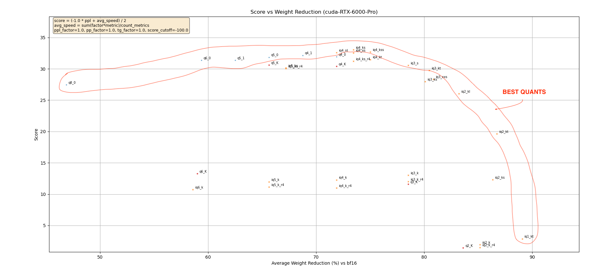
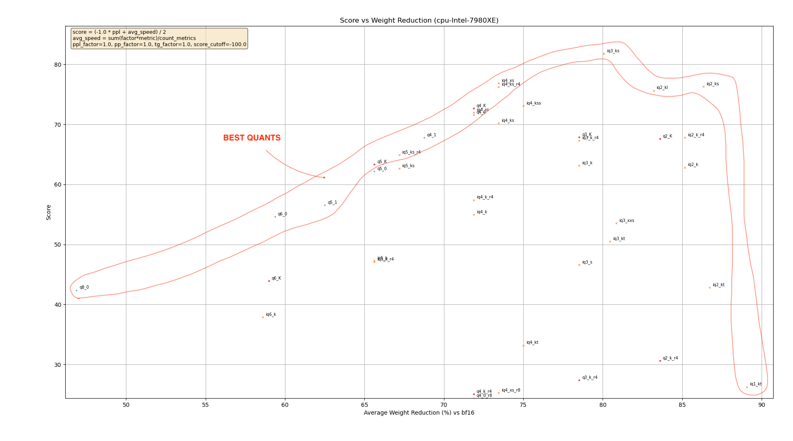
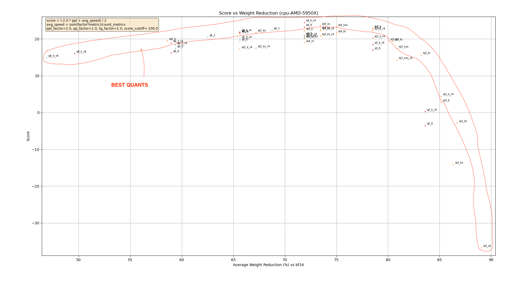

These results were produced using Qwen3-4B-Thinking-2507 and focused on evaluating the effects of quantizing the Core FFN weights (gate, down and up) all at once.

Run the following command to interact with the graphs:
```
GIT_LFS_SKIP_SMUDGE=1 git clone https://github.com/Thireus/GGUF-Tool-Suite/
cd GGUF-Tool-Suite/quants_graphs
../compare_results.py --ppl-results ppl_results.csv --pp-results pp_results_cpu-AMD-5950X.csv,pp_results_cpu-Intel-7980XE.csv,pp_results_cuda-RTX-6000-Pro.csv --tg-results tg_results_cpu-AMD-5950X.csv,tg_results_cpu-Intel-7980XE.csv,tg_results_cuda-RTX-6000-Pro.csv --group-tensors '.*' --show --export-csv quant_score --export-dir . --ppl-factor 2
```

The best quants are found at the top layer for each hardware considered, for instance:







## If you wish to produce similar graphs for your hardware:

### Tensors considered in benchmark_each_tensor.sh:
```
USER_REGEX=(
  ## Model head & embeddings
  'token_embd\.weight=bf16=locked'
  'output_norm\.weight=f32=locked'

  ## Multi-headed attention parameters
  'blk\.([0-9]|[1-2][0-9]|3[0-5])\.attn_v\.weight=bf16=locked'
  'blk\.([0-9]|[1-2][0-9]|3[0-5])\.attn_output\.weight=bf16=locked'
  'blk\.([0-9]|[1-2][0-9]|3[0-5])\.attn_k_norm\.weight=f32=locked'
  'blk\.([0-9]|[1-2][0-9]|3[0-5])\.attn_q\.weight=bf16=locked'
  'blk\.([0-9]|[1-2][0-9]|3[0-5])\.attn_norm\.weight=f32=locked'
  'blk\.([0-9]|[1-2][0-9]|3[0-5])\.attn_k\.weight=bf16=locked'
  'blk\.([0-9]|[1-2][0-9]|3[0-5])\.attn_q_norm\.weight=f32=locked'

  ## Core FFN weights
  'blk\.([0-9]|[1-2][0-9]|3[0-5])\.ffn_gate\.weight=bf16'
  'blk\.([0-9]|[1-2][0-9]|3[0-5])\.ffn_norm\.weight=f32=locked'
  'blk\.([0-9]|[1-2][0-9]|3[0-5])\.ffn_down\.weight=bf16'
  'blk\.([0-9]|[1-2][0-9]|3[0-5])\.ffn_up\.weight=bf16'
)

BASELINE_QTYPE="bf16"
```

### Tensors considered in collect_sweep_results.sh:
```
USER_REGEX=(
  ## Core FFN weights
  'blk\.([0-9]|[1-2][0-9]|3[0-5])\.ffn_gate\.weight'
  'blk\.([0-9]|[1-2][0-9]|3[0-5])\.ffn_down\.weight'
  'blk\.([0-9]|[1-2][0-9]|3[0-5])\.ffn_up\.weight'
)
```

### Speed benchmarking quants (needs to be run with and without -ot 'ffn_=CPU' for CPU/GPU offloading)
```
../benchmark_each_tensor.sh --mode 1 --qtypes iq1_m_r4 iq3_xxs iq2_k_r4 iq2_ks iq4_ks iq3_k iq4_xs iq5_k_r4 iq1_m iq1_s iq1_s_r4 q4_K q5_K q2_K iq2_k iq2_kl iq2_m iq2_m_r4 iq2_s iq2_xs iq2_xs_r4 iq2_xxs iq2_xxs_r4 iq3_kl iq3_k_r4 iq3_ks iq3_kt iq3_m iq3_s iq3_s_r4 iq3_xs iq3_xxs_r4 iq4_k iq4_k_r4 iq4_ks_r4 iq4_kss iq4_nl iq4_nl_r4 iq4_xs_r8 iq5_k iq5_ks iq5_ks_r4 iq6_k q2_k_r4 q2_k_s q3_K q3_k_l q3_k_m q3_k_r4 q3_k_s q4_0 q4_0_r8 q4_1 q4_k_m q4_k_r4 q4_k_s q5_0 q5_0_r4 q5_1 q5_k_m q5_k_r4 q5_k_s q6_0 q6_0_r4 q6_K q6_k_r4 q4_0_4_4 q4_0_4_8 q4_0_8_8 q8_0_r8 q8_k_r8 q8_KV q8_kv_r8 iq1_kt iq2_kt iq4_kt iq1_bn iq2_bn iq2_bn_r4 q8_0 --group-tensors '.*'
../collect_sweep_results.sh --group-tensors '.*' --auto-baseline bf16 --hide-empty --nkv 4096
```

### PPL+KLD benchmarking quants
```
../benchmark_each_tensor.sh --mode 0 --qtypes iq1_m_r4 iq3_xxs iq2_k_r4 iq2_ks iq4_ks iq3_k iq4_xs iq5_k_r4 iq1_m iq1_s iq1_s_r4 q4_K q5_K q2_K iq2_k iq2_kl iq2_m iq2_m_r4 iq2_s iq2_xs iq2_xs_r4 iq2_xxs iq2_xxs_r4 iq3_kl iq3_k_r4 iq3_ks iq3_kt iq3_m iq3_s iq3_s_r4 iq3_xs iq3_xxs_r4 iq4_k iq4_k_r4 iq4_ks_r4 iq4_kss iq4_nl iq4_nl_r4 iq4_xs_r8 iq5_k iq5_ks iq5_ks_r4 iq6_k q2_k_r4 q2_k_s q3_K q3_k_l q3_k_m q3_k_r4 q3_k_s q4_0 q4_0_r8 q4_1 q4_k_m q4_k_r4 q4_k_s q5_0 q5_0_r4 q5_1 q5_k_m q5_k_r4 q5_k_s q6_0 q6_0_r4 q6_K q6_k_r4 q4_0_4_4 q4_0_4_8 q4_0_8_8 q8_0_r8 q8_k_r8 q8_KV q8_kv_r8 iq1_kt iq2_kt iq4_kt iq1_bn iq2_bn iq2_bn_r4 q8_0 --group-tensors '.*'
../collect_ppl_results.sh --chunks 584 --group-tensors '.*' --auto-baseline bf16
```
